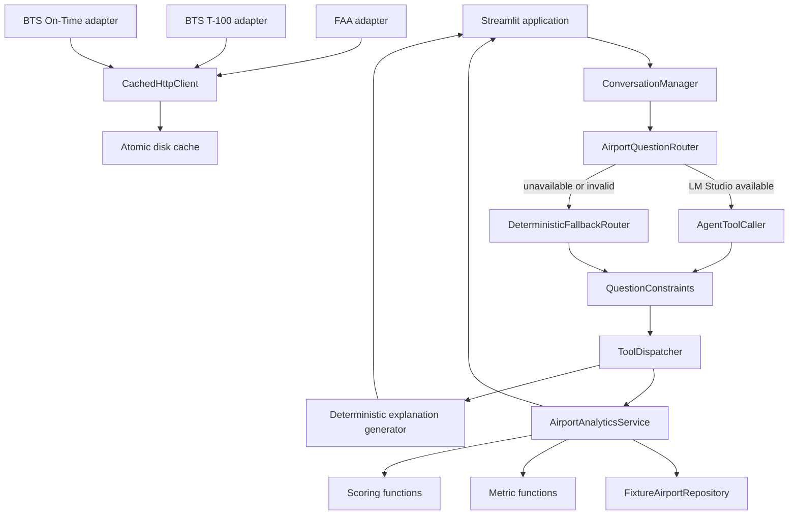

# Design: Airport Investment Intelligence Agent

## 1. Purpose

The application screens a small supported airport universe for capacity-expansion signals while keeping the analytical result reproducible, auditable, and usable without external services.

The design separates language understanding from calculation:

- Qwen may interpret a supported question and select one approved tool.
- Python validates the complete request and performs every metric, score, ranking, and explanation.
- Deterministic fallback keeps the four assignment questions available when LM Studio is stopped.
- Structured provenance identifies whether data is illustrative, live public data, or cached public data.

## 2. Goals

- Answer the four assignment questions deterministically.
- Preserve explicit user choices such as airports, exclusions, metrics, limits, mileage thresholds, and load factors.
- Fail closed when intent or conversational references are ambiguous.
- Keep scoring repeatable and bounded.
- Make missing data visible through confidence and penalties.
- Keep the demonstration independent of public API availability.
- Provide thin public-data boundaries that can be expanded later.

## 3. Non-goals

- Predicting investment return or project net present value.
- Replacing airport engineering, terminal planning, environmental, or regulatory studies.
- Supporting every US airport or every FAA/BTS field.
- Allowing arbitrary LLM-generated calculations or user-visible analytical prose.
- Automatically mixing fixtures and public records in one analytical output.
- Claiming that the unmet-capacity proxy is observed lost demand.

## 4. System architecture



## 5. Major components

### 5.1 Streamlit UI

`app.py` owns runtime wiring and Streamlit components. `src/ui.py` converts structured outputs into deterministic view models so formatting can be tested without a browser.

The page displays:

- Suggested prompts and chat history.
- Ranking and comparison tables.
- Metric and score cards.
- Source mode and analysis period.
- Confidence and assumptions.
- LM Studio status and fallback state.
- The exact configured threshold, load factor, and passenger floor used by the runtime.

`st.set_page_config` is called before other Streamlit commands. LM Studio health results are cached in session state for thirty seconds and are refreshed only after expiry, explicit refresh, or runtime configuration change.

### 5.2 Shared routing policy

`RoutingPolicy` contains the three defaults that can change question meaning:

- Ranking limit.
- Long-haul threshold.
- Target load factor.

One policy instance is derived from `Settings` and shared by:

- LM Studio semantic validation.
- Deterministic fallback parsing.
- Conversation-state initialization.
- Streamlit settings display.

This prevents the interface from showing one assumption while calculations use another.

### 5.3 Question constraints

`src/question_constraints.py` is the canonical deterministic parser for supported questions.

It extracts:

- Supported airport codes and aliases.
- Tool intent.
- Requested comparison metrics.
- Regional ranking exclusions.
- Ranking limits.
- Long-haul thresholds.
- Target load factors.

The same parsed constraint object is used to validate model calls and construct fallback calls. Important invariants include:

- A requested metric cannot be omitted.
- An unrequested metric cannot be added.
- Exclusion sets must exactly match named airports.
- Airport sets must exactly match the question.
- Optional numeric arguments use runtime defaults unless explicitly overridden.
- Unknown tools are rejected before semantic validation.

### 5.4 LM Studio client and agent

`LMStudioClient` provides:

- OpenAI-compatible base URL normalization.
- Optional authorization header.
- Model listing.
- Configured-model availability detection.
- Typed timeout, connection, HTTP, disabled, and invalid-response errors.
- Non-throwing health snapshots for the UI.

`AgentToolCaller` requests exactly one tool call from Qwen with `tool_choice="required"`. The selected name and arguments are structurally validated, semantically checked against the deterministic question constraints, and then passed to `ToolDispatcher`.

The model never calculates metrics or scores.

### 5.5 Deterministic fallback

`DeterministicFallbackRouter` uses the same parser and policy as the agent. It supports the four assignment intents and their explicit numeric overrides.

`AirportQuestionRouter` activates fallback when:

- No model client is configured.
- LM Studio is disabled or unavailable.
- The configured model is missing.
- The model returns prose or malformed tool calls.
- The model selects an unknown tool.
- Arguments fail structural or semantic validation.
- Approved tool execution fails before a valid result is produced.

Unsupported questions remain unsupported rather than being guessed.

### 5.6 Conversational context

`ConversationState` stores only approved analytical state:

- Airport codes.
- Region.
- One typed `ComparisonMetric`.
- Regional exclusions.
- Target load factor.
- Long-haul threshold.
- Ranking limit.
- Last tool name.

Conversation rules are deliberately conservative:

- A metric follow-up can reuse multiple prior airports.
- `Compare it with X` resolves only when exactly one prior airport exists.
- Multiple prior airports plus singular `it` is ambiguous and rejected.
- A new comparison without a selector clears any stale metric.
- A previous metric is reused only after an explicit `same metric` request.
- Non-comparison tools clear comparison metrics.
- Mixed include and exclude instructions fail closed.
- A new standalone airport question replaces stale airport context.

### 5.7 Tool dispatcher and analytical service

Only five tools are approved:

1. `rank_airports`
2. `compare_airports`
3. `calculate_long_haul_share`
4. `estimate_unmet_capacity`
5. `get_airport_profile`

Each tool has a strict Pydantic input and output contract. `ToolDispatcher` rejects unknown names, validates arguments, catches typed repository and validation failures, and returns a structured `ToolExecutionResult`.

`AirportAnalyticsService` coordinates repository reads, pure metrics, scoring, confidence, and provenance. It does not call the LLM.

## 6. Data architecture

### 6.1 Fixture repository

The default repository loads four normalized fixture datasets plus a source manifest:

- Airport metadata.
- Annual traffic.
- Annual operations.
- Route records.

Loader invariants include:

- Exact supported-airport coverage.
- One airport, traffic, and operations record per airport.
- Complete route departure denominators.
- No duplicate routes for origin, destination, and period.
- Matching airport and operations runway counts.
- Matching traffic and operations periods.
- Passengers not exceeding seats.
- Performed plus cancellations equalling scheduled departures.
- Route passengers not exceeding route seats.
- Explicit previous period and previous source for passenger growth.

The repository returns deep copies so callers cannot mutate shared records.

### 6.2 Provenance

Every normalized record has `SourceMetadata` containing:

- Source name.
- Data mode.
- Retrieval or fixture timestamp.
- Data period.
- Optional source URL.
- Notes.

Allowed modes are:

- `ILLUSTRATIVE DEMO DATA`
- `LIVE PUBLIC DATA`
- `CACHED PUBLIC DATA`

Analytical outputs require complete provenance closure: every nested source must also be represented at the output boundary, and every source period must be either the current analysis period or the immediately preceding comparable period.

### 6.3 Public-data adapters

The public boundary contains three intentionally thin clients:

- FAA airport identity metadata.
- BTS T-100 annual origin-airport summaries.
- BTS Airline On-Time Performance monthly origin summaries.

`CachedHttpClient` provides:

- Configurable timeout.
- Response-size limit.
- Optional Socrata application token.
- Transport injection for tests.
- Force refresh.
- Typed timeout, connection, HTTP, invalid-response, and not-found errors.

`DiskResponseCache` uses:

- SHA-256 request keys.
- Atomic payload and metadata replacement.
- Payload checksums.
- Configurable TTL.
- Corrupt-cache deletion.
- Visible cached-versus-live provenance.

Public adapters are not yet the default analytical repository. This avoids silent mixing of incomplete live records and the internally complete fixture universe.

## 7. Metric methodology

All functions in `src/metrics.py` are pure and deterministic.

### 7.1 Passenger growth

```text
passenger_growth = (current_passengers - previous_passengers) / previous_passengers
```

The previous period must be the immediately preceding comparable calendar period. A missing or zero previous passenger denominator returns unavailable.

### 7.2 Load factor

```text
load_factor = passengers / available_seats
```

Passengers above seats are rejected.

### 7.3 Completion rate

```text
completion_rate = performed_departures / scheduled_departures
```

Performed departures above scheduled departures are rejected.

### 7.4 Cancellation rate

When reported cancellations are available, they must equal `scheduled - performed`.

```text
cancellation_rate = cancellations / scheduled_departures
```

When reported cancellations are absent, the deterministic difference is used.

### 7.5 Departures per runway

```text
departures_per_runway = performed_departures / usable_runway_count
```

This is a coarse pressure proxy, not a runway-capacity simulation.

### 7.6 Long-haul share

A route qualifies when:

```text
distance_miles >= threshold_miles
```

The tool reports both:

```text
flight share = qualifying departures / all departures
passenger share = qualifying passengers / all route passengers
```

The complete route departure universe must equal performed departures.

### 7.7 Projected demand

Raw passenger growth is clamped to `-10%..20%`:

```text
projected_passengers = current_passengers * (1 + clamped_growth)
```

### 7.8 Estimated unmet-capacity proxy

```text
required_seats = projected_passengers / target_load_factor
estimated_unmet_capacity_proxy = max(0, required_seats - current_available_seats)
```

This is not observed denied demand and does not prove that a terminal project is financially viable.

## 8. Scoring methodology

### 8.1 Normalization

Each raw value is converted into an empirical percentile rank across the complete supported reference universe:

```text
percentile = 100 * (count(lower) + 0.5 * count(equal)) / count(non-missing)
```

Percentile normalization was selected instead of min-max normalization so one extreme airport does not compress the rest of the score range.

### 8.2 Congestion score

```text
0.40 * departure-delay percentile
+ 0.25 * taxi-out percentile
+ 0.20 * cancellation-rate percentile
+ 0.15 * departures-per-runway percentile
```

### 8.3 Investment opportunity score

```text
0.30 * passenger-growth percentile
+ 0.25 * load-factor percentile
+ 0.20 * congestion score
+ 0.15 * unmet-capacity percentile
+ 0.10 * market-scale percentile
```

### 8.4 Missing data

Available component weights are renormalized. Missing root inputs are deduplicated across derived metrics.

```text
uncertainty penalty = min(20, 4 * missing root component count)
final opportunity score = max(0, base score - uncertainty penalty)
```

A missing derived congestion score is not counted again when its four raw inputs are already missing.

Confidence is based on the number of available root components and exposes the exact missing field list.

### 8.5 Recommendation bands

- 75–100: Strong candidate for deeper diligence.
- 60–<75: Potential candidate.
- 40–<60: Mixed evidence.
- <40 or unavailable: Weak current expansion signal.

### 8.6 Deterministic tie-breaker

1. Higher investment opportunity score.
2. Higher passenger growth.
3. Higher passenger volume.
4. Airport code alphabetically.

## 9. Explanation design

The original concept allowed Qwen to explain structured results. The implemented MVP intentionally uses deterministic templates only.

This avoids unsupported claims such as:

- Guaranteed profit.
- Risk-free expansion.
- Fabricated geography.
- Numbers reassigned to unrelated fields.
- Scientific-notation or written-number bypasses.

Every explanation includes:

- Source mode.
- Analysis period.
- Source names.
- Retrieval or fixture dates.
- Source periods.
- Assumptions and limitations.

## 10. Failure behavior

| Failure | Behavior |
|---|---|
| LM Studio disabled | Deterministic fallback |
| LM Studio timeout or connection failure | Deterministic fallback |
| Configured model missing | Deterministic fallback |
| Model prose instead of one tool call | Reject and use fallback |
| Unknown tool | Reject and use fallback |
| Valid but semantically changed arguments | Reject and use fallback |
| Unsupported fallback question | Fail closed |
| Unsupported airport code | Typed tool execution error |
| Contradictory fixture data | Loader or metric validation failure |
| Missing analytical inputs | Renormalized score, penalty, reduced confidence, or unavailable result |
| Corrupt or expired public cache | Delete or ignore and fetch again |
| Public response too large or malformed | Typed public-data error |

## 11. Testing strategy

### Unit tests

- Domain contracts and provenance.
- Fixture invariants and read-only behavior.
- Metric formulas and invalid denominators.
- Scoring bounds, missing data, and tie-breakers.
- Analytical tool happy paths and typed failures.
- LM Studio health and malformed responses.
- Semantic grounding and unknown tools.
- Fallback routing and explicit overrides.
- Conversation ambiguity and state replacement.
- Deterministic explanation provenance.
- Public-client normalization and disk cache.
- UI view-model formatting.

### Integration and acceptance tests

- Streamlit AppTest startup with `USE_LLM=false`.
- All four assignment questions through the real fixture-backed fallback runtime.
- Explicit overrides through parser, router, dispatcher, and tools.
- Real conversational follow-ups through the real analytical service.
- HTTP rejection during the core offline acceptance path.

### CI policy

GitHub Actions installs declared dependencies, compiles all Python sources, and runs the complete suite with:

```text
USE_LLM=false
USE_LIVE_DATA=false
```

No public endpoint or local model is required for test success.

## 12. Tradeoffs

### Fixtures by default

**Benefit:** reproducible demo and complete denominators.

**Cost:** results are illustrative rather than current.

### Local Qwen for routing only

**Benefit:** natural-language interface without trusting the model with calculations.

**Cost:** supported intent remains intentionally narrow.

### Deterministic explanation templates

**Benefit:** no unsupported narrative claims.

**Cost:** explanations are less conversational.

### Empirical percentile scoring

**Benefit:** stable bounded comparisons and reduced sensitivity to extreme values.

**Cost:** scores are relative to the supported airport universe and can change when that universe changes.

### Thin public adapters

**Benefit:** clear boundaries and manageable one-day scope.

**Cost:** live data is not yet a complete drop-in replacement for the fixture repository.

### Synchronous Streamlit runtime

**Benefit:** simple code and easy local execution.

**Cost:** public requests and local-model calls must be carefully cached to avoid blocking reruns.

## 13. Security and privacy

- Qwen runs locally through LM Studio when enabled.
- No credentials are committed; `.env` is ignored.
- Only approved tool schemas are exposed to the model.
- Unknown tools and extra arguments are rejected.
- The default test and demo paths do not send questions to external services.
- Public-data clients send only dataset queries, not chat history.

## 14. Future extensions

1. Build a normalized live-data repository that requires complete current and previous periods before replacing fixtures.
2. Add live runway and terminal-capacity data with explicit quality grades.
3. Version scoring policies and reference universes.
4. Add sensitivity analysis for weights and target load factors.
5. Add airport-level capital-cost and project-stage data without implying financial return.
6. Add stored analytical sessions and exportable reports.
7. Capture and commit a verified browser screenshot after local visual acceptance.
8. Add scheduled cache refresh and endpoint-schema monitoring.

## 15. Final design boundary

The agent is not the calculator. It is an optional, constrained selector in front of deterministic Python.

```text
User question
    -> deterministic constraints
    -> optional validated Qwen selection or deterministic fallback
    -> Pydantic tool input
    -> Python metrics and scoring
    -> structured output
    -> deterministic explanation and provenance
```

That boundary is the central safety and correctness decision of the project.
