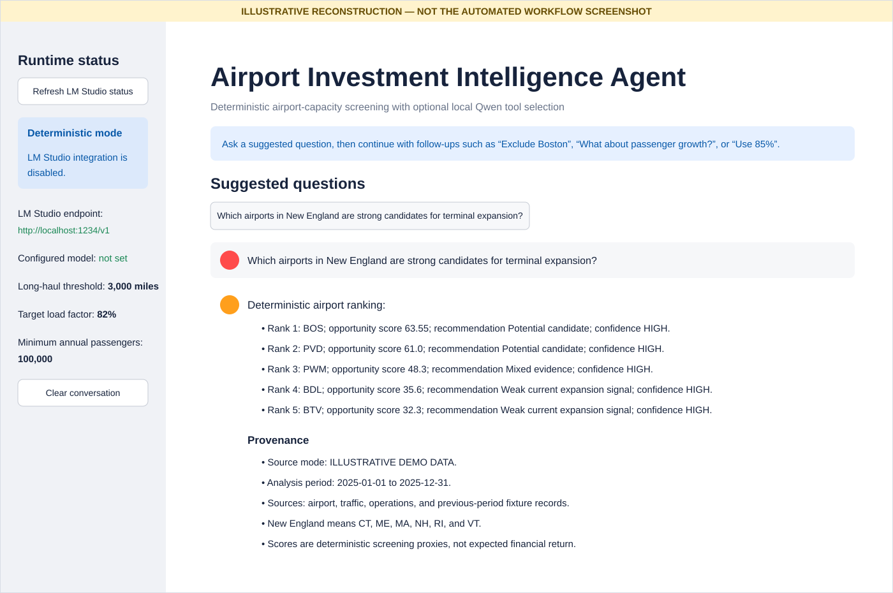
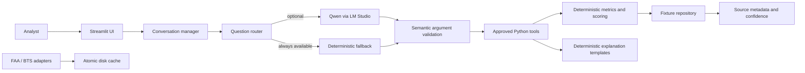

# Airport Investment Intelligence Agent

A local-first Streamlit analyst application for screening US airports for terminal and capacity-expansion signals. It combines validated fixture data, deterministic aviation metrics and scoring, optional local Qwen tool selection through LM Studio, and thin FAA/BTS public-data adapters.

The project is an analytical screening MVP. It does **not** predict investment returns, replace engineering diligence, or claim that its unmet-capacity proxy is observed lost demand.

## Illustrative interface reconstruction

The image below is a manually authored reconstruction of the expected deterministic Streamlit screen. It is **not** the PNG produced by the automated browser workflow. The workflow capture remains an ephemeral GitHub Actions artifact unless that exact binary is committed separately.



## Main features

- Answers the four assignment questions without internet or an LLM.
- Ranks supported airports with deterministic, repeatable scoring.
- Compares selected airport metrics side by side.
- Calculates flight- and passenger-weighted long-haul shares.
- Estimates a clearly labelled unmet-seat-capacity proxy.
- Supports validated conversational follow-ups and explicit overrides.
- Uses local Qwen only to select an approved tool when LM Studio is available.
- Displays deterministic explanations, confidence, assumptions, periods, and source provenance.
- Falls back safely when LM Studio is stopped or returns an invalid call.
- Includes cached FAA and BTS clients with typed failures and normalized responses.
- Runs a complete offline suite without requiring LM Studio or public APIs.

## Architecture



The public-data clients are implemented as a separate boundary. The default demonstration runtime intentionally uses validated illustrative fixtures so the assignment remains reproducible when public endpoints are unavailable.

## Technology stack

- Python 3.11+
- Streamlit
- Pydantic v2 and pydantic-settings
- pandas
- httpx
- LM Studio's OpenAI-compatible local API
- Qwen3 8B Instruct GGUF, recommended
- pytest and Streamlit AppTest

## Quick start on Windows

```powershell
python -m venv .venv
.venv\Scripts\Activate.ps1

python -m pip install --upgrade pip
pip install -r requirements.txt

Copy-Item .env.example .env
streamlit run app.py
```

Open the URL printed by Streamlit, normally `http://localhost:8501`.

## Quick start on macOS or Linux

```bash
python3 -m venv .venv
source .venv/bin/activate

python -m pip install --upgrade pip
pip install -r requirements.txt

cp .env.example .env
streamlit run app.py
```

## LM Studio and Qwen setup

The application works without LM Studio. Configure it only when you want local-model tool selection.

1. Install LM Studio.
2. Download a Qwen3 8B Instruct GGUF model. A Q4 quantization is a practical local default.
3. Load the model with an 8,192-token context window.
4. Start LM Studio's local OpenAI-compatible server, normally on port `1234`.
5. List the exact model ID:

```powershell
Invoke-RestMethod http://localhost:1234/v1/models
```

6. Copy the returned `id` into `.env`:

```env
LLM_BASE_URL=http://localhost:1234/v1
LLM_API_KEY=lm-studio
LLM_MODEL=<exact-model-id>
USE_LLM=true
```

A whitespace-only or incorrect model ID is rejected. When the server is unavailable, the required questions use deterministic fallback routing.

## Runtime configuration

| Variable | Default | Purpose |
|---|---:|---|
| `LLM_BASE_URL` | `http://localhost:1234/v1` | LM Studio OpenAI-compatible endpoint |
| `LLM_API_KEY` | `lm-studio` | Local authorization header value |
| `LLM_MODEL` | empty | Exact model ID reported by LM Studio |
| `USE_LLM` | `true` | Enables model-assisted tool selection |
| `USE_LIVE_DATA` | `false` | Reserved live-data mode flag; the demo repository remains fixture-backed |
| `HTTP_TIMEOUT_SECONDS` | `20` | HTTP timeout for local and public clients |
| `LONG_HAUL_THRESHOLD_MILES` | `3000` | Default long-haul threshold |
| `TARGET_LOAD_FACTOR` | `0.82` | Default capacity-proxy target load factor |
| `MIN_ANNUAL_PASSENGERS` | `100000` | Ranking eligibility floor |
| `PUBLIC_DATA_CACHE_DIR` | `data/cache/public` | Public-response disk cache |
| `PUBLIC_DATA_CACHE_TTL_SECONDS` | `86400` | Cache time to live |
| `PUBLIC_DATA_MAX_DOWNLOAD_MB` | `100` | Public-response size ceiling |
| `BTS_APP_TOKEN` | empty | Optional Socrata application token |

The same routing policy is supplied to model routing, deterministic fallback, conversation state, and the Streamlit sidebar. When routing defaults or the minimum-passenger eligibility floor change, existing conversation state and visible history are reset so displayed settings cannot diverge from executed ranking policy.

## Example questions

```text
Which airports in New England are strong candidates for terminal expansion?
Compare LAX and SNA congestion levels.
What is the percentage of long haul flights out of ANC?
What is the unmet flight demand in SFO and why?
```

Explicit overrides are preserved:

```text
Rank the top 3 New England terminal expansion candidates.
What share of ANC flights are long haul using 2,500 miles?
Estimate SFO unmet capacity at a target load factor of 85%.
```

Supported follow-ups include:

```text
What about passenger growth?
Exclude Boston.
Use 85%.
Compare it with ANC using passenger growth.  # only when one prior airport is unambiguous
```

Ambiguous pronouns, mixed include/exclude commands, unsupported metrics, invalid signed or zero overrides, and silently changed model arguments fail closed.

## Data and provenance

### Demonstration fixtures

The bundled airport, traffic, operations, and route values are labelled **ILLUSTRATIVE DEMO DATA**. They are synthetic, internally consistent, and designed for repeatable evaluation. They are not official FAA or BTS observations and must not be used for investment decisions.

Supported airports:

- New England: BOS, BDL, PVD, MHT, PWM, BTV
- California comparison: LAX, SNA
- Long haul: ANC
- Capacity proxy: SFO

### Public-data clients

Thin adapters are available for:

- FAA airport identity metadata
- BTS T-100 origin-airport totals through the latest reported month
- BTS Airline On-Time Performance monthly origin summaries

T-100 provenance distinguishes a complete December reporting year from a partial year-to-date period. Public numeric fields reject `nan`, positive infinity, and negative infinity. On-time rows also reject cancellation flags other than `0` or `1` and reject negative delay or taxi values rather than silently changing them.

Responses are normalized, assigned `LIVE PUBLIC DATA` or `CACHED PUBLIC DATA` provenance, size-limited, and stored using atomic checksum-protected cache writes.

Verify a real T-100 retrieval and immediate cache reuse locally:

```powershell
python scripts/verify_public_data.py
```

A manual-only workflow is also provided for live public-data and browser checks. These external checks do not gate the mandatory offline suite, and their results should be verified directly in the repository's GitHub Actions history. The command requires internet access; the default application and offline test suite do not.

## Deterministic methodology

Core metrics include:

- Passenger growth: `(current - previous) / previous`
- Load factor: `passengers / available seats`
- Completion rate: `performed departures / scheduled departures`
- Cancellation rate: validated reported cancellations, otherwise `scheduled - performed`
- Runway pressure: `performed departures / usable runways`
- Long-haul share: routes with distance greater than or equal to the configured threshold
- Projected demand: current passengers multiplied by clamped growth, with growth capped to `-10%..20%`
- Unmet-capacity proxy: `max(0, projected passengers / target load factor - current seats)`

Congestion score weights:

- 40% departure delay
- 25% taxi-out time
- 20% cancellation rate
- 15% departures per runway

Investment opportunity score weights:

- 30% passenger growth
- 25% load factor
- 20% congestion score
- 15% estimated unmet-capacity proxy
- 10% market scale

Inputs are converted to deterministic empirical percentile ranks. Missing weights are renormalized. Each missing root input applies a four-point uncertainty penalty, capped at twenty points, and reduces confidence once.

See [DESIGN.md](DESIGN.md) for formulas, boundaries, tradeoffs, and failure behavior.

## AI versus deterministic responsibilities

**Qwen may:**

- Select exactly one approved tool.
- Supply arguments that exactly match the user's explicit request.

**Qwen may not:**

- Calculate metrics or scores.
- Add, remove, or alter airports, exclusions, metrics, limits, thresholds, or load factors.
- Invoke unknown tools.
- Produce user-visible analytical prose in this MVP.

Python validates all arguments, executes every calculation, and renders deterministic explanation templates.

## Tests

Run the complete suite:

```powershell
python -m compileall -q app.py src tests scripts
python -m pytest
```

The suite covers metrics, scoring, tools, provenance, missing data, repeated include/exclude actions, ambiguous bare load factors, signed and zero overrides, LLM failure, deterministic fallback, signed conversational follow-ups, passenger-floor session resets, public-client caching, partial T-100 periods, non-finite and malformed on-time values, the four assignment questions, and Streamlit startup.

GitHub Actions runs the same offline suite on pull requests and pushes to `main`. Use the current workflow result as the source of truth for the exact passing-test count.

## Demo sequence

1. Start the app with LM Studio stopped and ask all four assignment questions.
2. Show source mode, analysis period, confidence, assumptions, and deterministic tables.
3. Ask `Rank the top 3 New England terminal expansion candidates.`
4. Follow with `Exclude Boston.`
5. Ask `Compare LAX and SNA congestion.` followed by `What about passenger growth?`
6. From one stored airport, ask `Compare it with ANC using passenger growth.`
7. Ask the ANC question with `2,500 miles` and confirm the override is displayed.
8. Ask the SFO question with an `85%` target load factor.
9. Start LM Studio with the configured Qwen model and show validated model-assisted routing.
10. Stop LM Studio and confirm fallback still works.
11. Optionally run `python scripts/verify_public_data.py` to demonstrate live-to-cache T-100 retrieval.

## Repository layout

```text
app.py                         Streamlit runtime wiring
src/models.py                  Validated domain and tool models
src/data/fixture_loader.py     Fixture normalization and invariants
src/data/repository.py         Read-only fixture repository
src/data/public_clients.py     FAA/BTS adapters and disk cache
src/metrics.py                 Pure metric functions
src/scoring.py                 Deterministic percentile scoring
src/tools.py                   Five approved analytical tools
src/question_constraints.py    Shared question parser and grounding
src/agent.py                   LM Studio tool-call boundary
src/router.py                  Deterministic fallback
src/conversation.py            Fail-closed conversation state
src/explanations.py            Deterministic user-visible explanations
src/ui.py                      Pure Streamlit view models
scripts/                       Public-data and screenshot verification scripts
docs/images/                   Illustrative interface reconstruction
tests/                         Unit, integration, and offline acceptance tests
```

## Limitations and known assumptions

- Fixture values are synthetic and support demonstration only.
- The scoring model is a screening heuristic, not a financial model.
- Percentile scores depend on the supported reference airport universe.
- Runway pressure does not model runway configuration, weather, gates, terminal geometry, or hourly peaks.
- The unmet-capacity value is a seat-capacity proxy, not measured denied demand.
- Public-data adapters are intentionally thin and are not yet the default analytical repository.
- Future live requests still depend on external endpoint availability and schema stability.
- Qwen routing quality depends on the local model, but semantic validation and fallback prevent silent changes to supported requests.

## Disclaimer

This application is for technical demonstration and preliminary analytical screening. Any real airport investment decision requires current official data, engineering studies, environmental review, regulatory analysis, capital-cost estimates, financing assumptions, airline commitments, and professional investment diligence.
